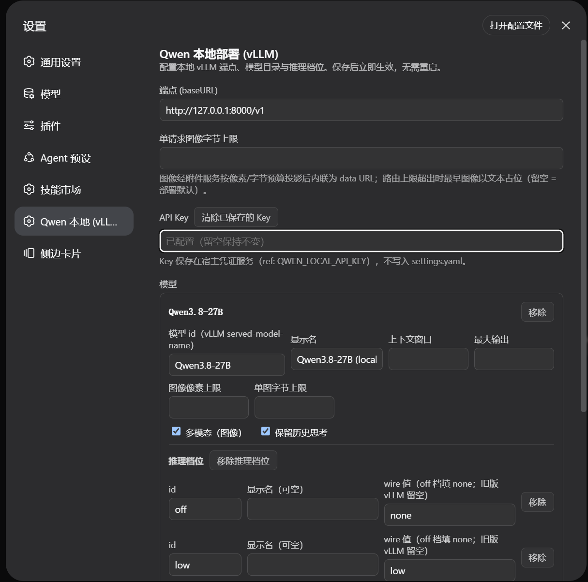
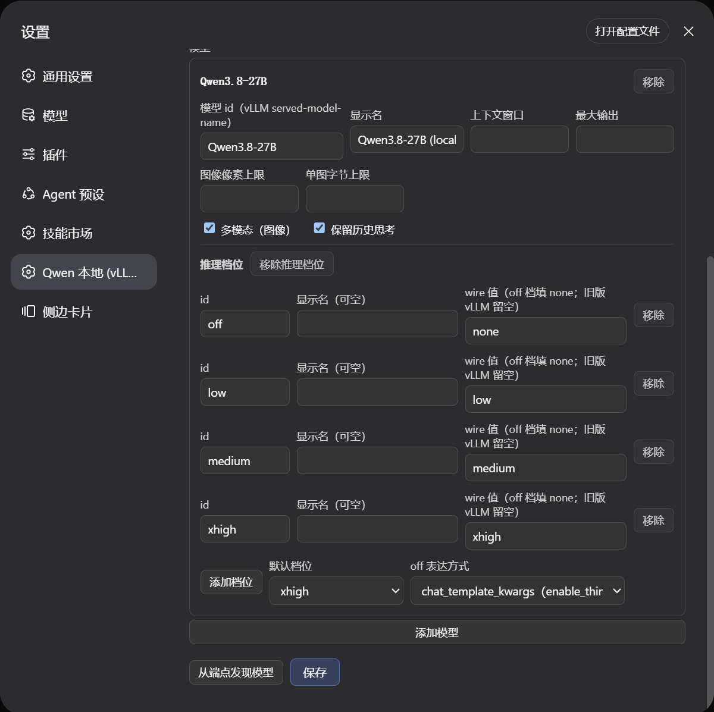
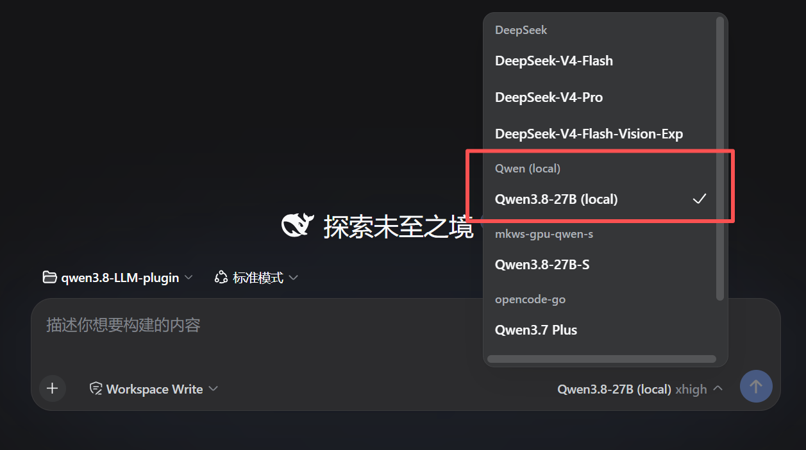
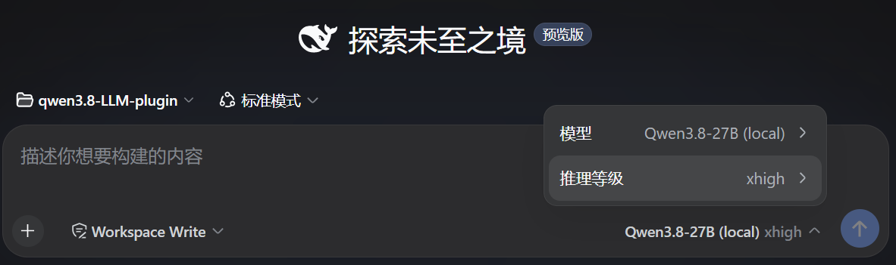

# dsh-llm-qwen-local

English | [简体中文](README.zh.md)



DeepSeek Harness LLM adapter plugin for a **locally deployed Qwen model** (e.g. Qwen3.8-27B) served by **vLLM** behind its OpenAI-compatible `/v1/chat/completions` endpoint.

> **v0.4.0** · exact compatibility target: DSH `0.1.2-rc.1` · MIT · community-maintained and not a DeepSeek or Qwen product.

> **✨ New in v0.4.0 — zero runtime `@deepseek-ai` dependencies**
>
> **The published plugin no longer depends on any `@deepseek-ai` package at runtime** — no `schemastery`, `dsh-llm`, `dsh-settings`, `dsh-attachment`, `dsh-launch-environment`, or `cordis`. Its only runtime dependencies are the MIT-licensed `eventsource-parser` and Node.js builtins.
>
> **Why:** the plugin now reproduces every DSH seam it touches (adapter contract, failure snapshots, brand ids, API-key/attribution/launch-env helpers, the settings-namespace `Config` surface) as small local modules under `src/harness/` plus a frozen, hand-owned configuration surface. It loads against the host's live services without importing the packages that define them — the same dependency posture as the `dsh-llm-ollama` reference implementation.
>
> **What does *not* change:** external plugin behavior is identical — provider route `qwen-local`, settings namespace `llm-qwen-local`, the settings page, model discovery, and the wire dialect. The DSH compatibility target stays `0.1.2-rc.1`. The `@deepseek-ai` packages remain **dev-only** type pins (their `import type` references are erased from the build), so existing installs keep working as-is.
>
> **Upgrading:** drop-in — just `dsh plugin --profile web add dsh-llm-qwen-local@0.4.0` (or your pinned snapshot tag). No configuration changes required.

```sh
dsh plugin --profile web add dsh-llm-qwen-local
```

Two deployment-specific knobs are first-class:

- **Per-model multimodal switch** (`multimodal: true/false`) — declares whether the deployment serves the model with vision.
- **Fully configurable reasoning efforts** — every selectable level, its display name, its `reasoning_effort` wire spelling, the default level, and how `off` is expressed on the wire all come from configuration, matching whatever vocabulary your vLLM build accepts.

```yaml
- id: llm-qwen-local
  name: dsh-llm-qwen-local
  config:
    baseURL: http://127.0.0.1:8000/v1
    models:
      - id: qwen3.8
        name: Qwen3.8 (local)
        multimodal: true
        reasoning:
          efforts:
            - { id: off, wire: none }
            - { id: low, wire: low }
            - { id: medium, wire: medium }
            - { id: xhigh, wire: xhigh }
          defaultEffort: xhigh
```

## Documentation

| | English | 中文 |
|---|---|---|
| Installation & usage | (this README) | (此 README) |
| Configuration reference — every field | [docs/configuration.md](docs/configuration.md) | [docs/configuration.zh.md](docs/configuration.zh.md) |
| Design notes — wire dialect, model parameters, framework compatibility, error paths, limitations | [docs/design.md](docs/design.md) | [docs/design.zh.md](docs/design.zh.md) |

## Requirements

- An installed `dsh` (the CLI) **0.1.2-rc.1 or newer**, and a vLLM instance serving your Qwen model with the OpenAI-compatible API.
- Node.js with global `fetch` (18+).
- A profile whose composition mounts `@deepseek-ai/dsh-attachment` — the standard `web` and `headless` profiles do, via `dsh-base`.

### Supported DSH versions

| DSH version | Status |
|---|---|
| **0.1.2-rc.1** and newer | ✅ **Supported** — the version the plugin is built and tested against. |
| **0.1.1-rc.2** and older | ⛔ **Not supported** — the web app **fails to boot** (see below). |

The plugin's settings page talks to the host through DSH's **0.1.2 "remote-namespace" client model** (`ctx.remote.settings` / `ctx.remote.credentials` / `ctx.remote.llm`). Those typed namespaces are host-provided services that **only exist on DSH 0.1.2 and newer** — earlier releases (e.g. `0.1.1-rc.2`) expose the older shared `api`/`connection` client instead, so the page cannot find them.

If you install the plugin on an unsupported DSH, the web app aborts at startup with:

```
web boot: 1 entry did not activate
dsh-llm-qwen-local: pending (waiting for services: remote.credentials, remote.llm, remote.settings)
```

This is expected on DSH < 0.1.2 — the plugin is not compatible with that version. **Fix:** upgrade `dsh` to `0.1.2-rc.1` or newer, or remove the plugin on the older build:

```sh
dsh plugin --profile web remove dsh-llm-qwen-local
```

**Required vLLM serve flags** (per the official vLLM recipe): `--reasoning-parser qwen3` is effectively mandatory — without it the whole reasoning block lands in `message.content` — plus `--enable-auto-tool-choice --tool-call-parser qwen3_coder` for tool calling and `--max-model-len 262144` (or higher).

## Install

```sh
# install from npm (recommended — prebuilt, no build step on install):
dsh plugin --profile web add dsh-llm-qwen-local

# install from git (the prepare script builds lib/ on install):
dsh plugin --profile web add github:starefinger/dsh-llm-qwen-local

# or from a local checkout (same prepare build runs on install):
dsh plugin --profile web add ./path/to/qwen3.8-LLM-plugin

# or from a packed tarball (prebuilt — no build step on install):
dsh plugin --profile web add ./dsh-llm-qwen-local-0.4.0.tgz

# verify the contributed layer, then start:
dsh --profile web --dump-config
dsh --profile web
```

### Version-pinned install (tag)

Each compatibility snapshot is tagged with the dsh version it targets. Snapshots published since 0.3.1 use `dsh-<dsh-version>-plugin-<plugin-version>` (dsh version first, plugin version as suffix); earlier snapshots use the bare `dsh-<dsh-version>` form. **For a given dsh version, several tags may exist — use the one with the newest plugin-version suffix: it is the latest snapshot that supports your dsh.** To install a specific snapshot, append `#<tag>` to the git URL — pnpm resolves the tag to the exact commit, so the install is reproducible and independent of `main`'s current state:

```sh
# install the latest snapshot for dsh 0.1.2-rc.1 (plugin 0.4.0):
dsh plugin --profile web add "git+https://github.com/starefinger/dsh-llm-qwen-local.git#dsh-0.1.2-rc.1-plugin-0.4.0"
```

Pick the tag matching your dsh version (`dsh --version`) — when several tags share the same dsh version, take the newest plugin-version suffix. After upgrading dsh, remove and re-add with the tag for the new version:

```sh
dsh plugin --profile web remove dsh-llm-qwen-local
dsh plugin --profile web add "git+https://github.com/starefinger/dsh-llm-qwen-local.git#dsh-<new-dsh-version>-plugin-<plugin-version>"
```

Tags are immutable snapshots: a fix for an already-published tag ships as a new tag (a newer plugin-version suffix for the same dsh version), never by moving an existing one.

Git and local-path installs run the package's `prepare` script (→ `pnpm build`) to produce `lib/` during install. pnpm v10 blocks dependency build scripts until they are allowed: if the first install fails with a "blocked build scripts" notice, add the exact key pnpm printed under `allowBuilds` in the profile's `pnpm-workspace.yaml`, then re-run the same `dsh plugin add` command. The tarball install is prebuilt and never needs this.

## Quick start

### 1. Configure on the settings page

The bundle's `cordis.patch.yml` inserts a baseline `llm-qwen-local` line (model `qwen3.8`, `multimodal: true`, `off/low/medium/xhigh` efforts, default `xhigh`). Open **Settings → Qwen 本地 (vLLM)** to edit it: endpoint, optional API key (stored in the host credentials service, never in `settings.yaml`), and one card per model — id, display name, context window, output cap, image budgets, the multimodal switch, thinking preservation, and the reasoning-effort table:




- **Discover models** probes `{baseURL}/models` and merges the ids it finds.
- **Save** applies **live** — the adapter re-resolves per request, so a saved change reaches the next model call without a restart.
- Prefer config files? Override the line from your profile's `cordis.patch.yml` by `id: llm-qwen-local` — a patch replaces the target line's **entire** `config` (no deep merge), so restate every key you keep.

### 2. Select the model

In the Web UI's model selector, the baseline `qwen3.8` entry appears under its **Qwen (local)** provider group:



### 3. Switch the reasoning level per request

Click the input footer (model name + effort, e.g. `Qwen3.8-27B (local) xhigh`) to switch the session model or the per-request **reasoning level** (the levels your config declares, e.g. `off` / `low` / `medium` / `xhigh`):



## Configuration at a glance

All fields except `models` are optional; schema defaults fill the rest.

| Field | Default | Meaning |
|---|---|---|
| `baseURL` | `http://127.0.0.1:8000/v1` | Endpoint base; `/chat/completions` is appended. |
| `apiKeyEnv` | — (no auth header) | Env-var name holding an optional bearer token, read per request. |
| `models` | **required** | At least one model entry (see below). |
| `defaultContextWindow` | `262144` | Context capacity used when a model has no exact value. |
| `maxTokens` | `32768` | Per-request output cap fallback. |
| `maxRequestImageBytes` | — (keep every image) | Total inlined base64 image payload bound per request; the oldest images are placeholder-swapped when exceeded. |

Model entries: `id` (**required**), `name`, `contextWindow`, `maxTokens`, `multimodal` (the vision switch — set `true` for Qwen3.8-27B), `preserveThinking`, `imageMaxPixels`, `imageMaxBytes`, and `reasoning` (absent = no selectable efforts).

Full field-by-field reference, the multimodal switch semantics (over- vs under-claiming), and the reasoning-effort details: [docs/configuration.md](docs/configuration.md) · [中文](docs/configuration.zh.md).

## Headline limitations

- **A modality declaration is not verified** — `multimodal: true` on a text-only endpoint fails mid-turn after the image message is durable; `multimodal: false` on a vision endpoint is **silent** (images become text placeholders).
- **Tool-result images ride a follow-up user message** — the vLLM wire is text-only in `role: 'tool'`, so for a multimodal model an image inside a tool result is split into a follow-up `role: 'user'` multimodal message.
- **No video input, no DashScope / Qwen Cloud** — the harness has no video content block, and the adapter targets local OpenAI-compatible servers only.

The complete list (thinking-replay shape, projection caveats, deferred work) and what this plugin does not claim: [docs/design.md](docs/design.md) · [中文](docs/design.zh.md).

## Development

```sh
pnpm install
pnpm build     # tsc → lib/ + client bundle
pnpm typecheck
pnpm test      # vitest: serialization, translation, e2e against a mock vLLM
```

Tests run against a scripted in-process vLLM (SSE) mock — no real model or endpoint is required.

## Zero runtime harness dependencies

The published plugin carries **no runtime dependency on any `@deepseek-ai` package** (no `schemastery`, `dsh-llm`, `dsh-settings`, `dsh-attachment`, `dsh-launch-environment`, or `cordis`). Its only runtime dependencies are the MIT-licensed `eventsource-parser` and Node.js builtins. The DSH seams it touches — the `LlmAdapter` contract, the `LlmError` failure snapshot, brand identity functions, API-key validation, attribution headers, the launch-environment reader, the content/image helpers, and the settings-namespace `Config` surface — are reproduced as small local modules under `src/harness/` and a frozen, hand-owned configuration surface in `src/config.ts`, so the plugin loads against the host's live services without importing the packages that define them.

The `@deepseek-ai` packages remain **dev** dependencies: they pin the type-level contract (the `import type` imports are erased from the build) and let the test suite boot a real `LlmRuntime`. If a host changes a seam's runtime shape, the local module must be updated to match — the `tests/boot.test.ts` regression drives the real Cordis load-time validator against the frozen `Config` to catch a drift in the one seam that is validated at plugin load.

Regenerating the frozen settings envelope after a `Config` shape change: `node scripts/extract-envelope.mjs --check` (diffs the frozen constant against the reference schema in `scripts/envelope-source.ts`; run the plain mode on a pre-refactor tree to re-capture).

## License

This repository is licensed under [MIT](LICENSE).

The plugin's only runtime dependencies are MIT-licensed (`eventsource-parser`, plus Node.js builtins); it has no runtime dependency on any `@deepseek-ai` package. Its development toolchain includes TypeScript (Apache-2.0) among other MIT-licensed tools, and the `@deepseek-ai` packages remain available as dev-only type pins. No DeepSeek Harness or Qwen source is vendored into this repository. The Qwen3.8-27B model weights and the DSH product remain subject to their own upstream terms; this plugin is a community project and is not an official DeepSeek or Qwen/Alibaba product.
